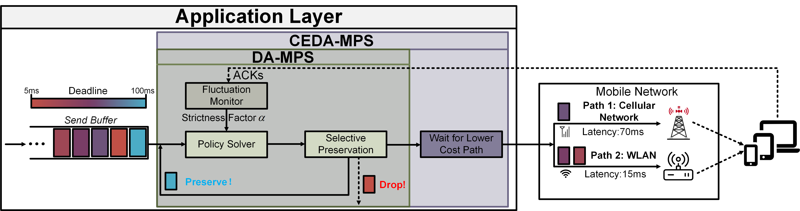

# A Deadline-Aware Packet Scheduler and Its Cost Efficient Extension for MPQUIC 

**D**eadline-**A**ware **M**ultipath **P**acket **S**cheduler, **DA-MPS**, is designed to deliver more packets before their deadlines in dynamic networks. The fluctuation monitor module can detect the dynamic of networks and adjust the stringency of deadline requirements. 

We  also propose a cost efficient extension, **CEDA-MPS**,  witch can enhance cost efficiency without compromising deadline requirements.

## At the beginning

Our implementation is based on the MPQUIC-go codebase. 

**Please read https://multipath-quic.org/2017/12/09/artifacts-available.html to figure out how to setup the code.**

## Usage

- Install Go 1.10.3

- Clone the code reposition

  > git clone https://github.com/MLCL-SYSU/Deadline-Packet-Scheduler.git

- Compile the MPQUIC server `server.exe` and MPQUIC client `client.exe`

  > go install ./...

- You can run any network script with MPQUIC server `server.exe` and MPQUIC client `client.exe`

## Requirements

- Go 1.10.3

- Ubuntu LTS (18.04)
